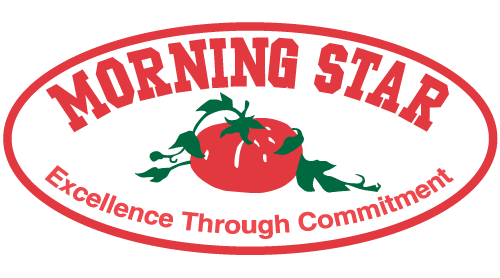

# Self-management
## "Morningstar"
Presented by Yingchen Zhang

---

## A company...

1. No boss, no management

2. Employees are responsible for colleagues

3. Everyone can spend the budget

4. Contribution decides Salary

---

## What
###  The definition of self-management

1. Form of company organization and management

1. Shared vision and goals

2. Employee relationship is a network structure

3. Emphasize mutual trust, sharing and innovation

---

## Case study: Morningstar

1. The world's largest tomato processor
2. 400 employees and >$70B in annual revenue
3. Founded in 1970

---

### Mission and Vision

---

## How
### Morningstar + Self-Management?

• Make the tasks be boss

• Ask employees to sign CLOU

• Empower everyone

• Contribute for gain

---

### 1/4 Make the tasks be boss

---

### 2/4 Ask employees to sign CLOU
For employees, the CLOU(Colleague Letter of Understanding)is: 
1. two employees sign clou with each other
2. Includes up to 30 areas of activity (details results, objectives and KOIs)
3. Guarantees among colleagues to check the achievement of targets.

---

### 3/4 Empower everyone

Can send a purchase order and Doesn't get permission

---

### 4/4 Contribute for gain
1. everyone is not equal
2. more influential = higher levels of pay
3. more contribution = more favorable comments

---

## Why
### The advantages
• More proactive

• More expertise

• More flexible

• More cooperation

• Better judgment

• More loyal

• Cost saving

---

### The disadvantages
• Tougher Adjustment

• Longer Induction

---

# Thank you

